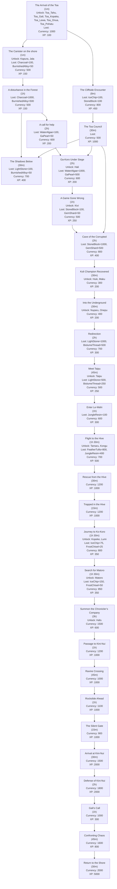

```mermaid
graph TD
  story_toa_arrival["The Arrival of the Toa
(1m)
Unlock: Toa_Tahu, Toa_Gali, Toa_Kopaka, Toa_Lewa, Toa_Onua, Toa_Pohatu
Loot: 
Currency: 1000
XP: 100"]
  maskhunt_kopaka_pohatu_icecliff["The Cliffside Encounter
(8m)
Loot: IceChip=100, StoneBlock=100
Currency: 800
XP: 450"]
  story_toa_council["The Toa Council
(30m)
Loot: 
Currency: 500
XP: 1000"]
  maskhunt_tahu_cave_akaku["The Shadows Below
(30m)
Loot: LightStone=100, BurnishedAlloy=50
Currency: 700
XP: 400"]
  mnog_find_canister_beach["The Canister on the shore
(1m)
Unlock: Kapura, Jala
Loot: Charcoal=100, BurnishedAlloy=50
Currency: 500
XP: 150"]
  mnog_tahu_unlock_01["A disturbance in the Forest
(1h)
Loot: Charcoal=1000, BurnishedAlloy=500
Currency: 500
XP: 150"]
  mnog_ga_koro_sos["A call for help
(2h)
Loot: WaterAlgae=100, GaPearl=50
Currency: 600
XP: 200"]
  mnog_restore_ga_koro["Ga-Koro Under Siege
(2h)
Unlock: Hali
Loot: WaterAlgae=1000, GaPearl=500
Currency: 600
XP: 200"]
  mnog_po_koro_sickness["A Game Gone Wrong
(1h)
Unlock: Kivi
Loot: StoneBlock=100, GemShard=50
Currency: 500
XP: 250"]
  mnog_po_koro_cave_investigation["Cave of the Corrupted
(2h)
Loot: StoneBlock=1000, GemShard=500
Currency: 800
XP: 400"]
  mnog_recruit_hewkii["Koli Champion Recovered
(30m)
Unlock: Huki, Maku
Currency: 300
XP: 200"]
  mnog_arrive_onu_koro["Into the Underground
(30m)
Unlock: Nuparu, Onepu
Currency: 400
XP: 200"]
  mnog_onu_koro_lava_problem["Redirection
(2h)
Loot: LightStone=1000, BiolumeThread=500
Currency: 700
XP: 300"]
  mnog_meet_taipu["Meet Taipu
(45m)
Unlock: Taipu
Loot: LightStone=500, BiolumeThread=250
Currency: 500
XP: 250"]
  mnog_enter_le_wahi["Enter Le-Wahi
(1h)
Loot: JungleResin=100
Currency: 600
XP: 300"]
  mnog_flight_to_hive["Flight to the Hive
(1h 30m)
Unlock: Tamaru, Kongu
Loot: FeatherTufts=800, JungleResin=400
Currency: 700
XP: 500"]
  mnog_rescue_from_hive["Rescue from the Hive
(30m)
Currency: 1200
XP: 1000"]
  mnog_lewa_v_onua["Trapped in the Hive
(15m)
Currency: 1200
XP: 1000"]
  mnog_arrive_ko_koro["Journey to Ko-Koro
(1h 30m)
Unlock: Kopeke, Lumi
Loot: IceChip=75, FrostChisel=25
Currency: 800
XP: 350"]
  mnog_search_for_matoro["Search for Matoro
(1h 30m)
Unlock: Matoro
Loot: IceChip=150, FrostChisel=50
Currency: 850
XP: 350"]
  mnog_summon_chroniclers_company["Summon the Chronicler’s Company
(3h)
Unlock: Hafu
Currency: 1500
XP: 600"]
  mnog_journey_to_kini_nui_1["Passage to Kini-Nui
(1h)
Currency: 1200
XP: 1000"]
  mnog_journey_to_kini_nui_2["Ravine Crossing
(45m)
Currency: 1000
XP: 1000"]
  mnog_journey_to_kini_nui_3["Rockslide Ahead
(1h)
Currency: 1100
XP: 1000"]
  mnog_journey_to_kini_nui_4["The Silent Gate
(15m)
Currency: 900
XP: 1000"]
  mnog_kini_nui_arrival["Arrival at Kini-Nui
(30m)
Currency: 1500
XP: 2000"]
  mnog_kini_nui_defense["Defense of Kini-Nui
(2h)
Currency: 1800
XP: 2000"]
  mnog_gali_call["Gali's Call
(1h)
Currency: 1000
XP: 300"]
  mnog_witness_makuta_battle["Confronting Chaos
(45m)
Currency: 1600
XP: 800"]
  mnog_return_to_shore["Return to the Shore
(30m)
Currency: 2000
XP: 5000"]
  story_toa_arrival --> maskhunt_kopaka_pohatu_icecliff
  maskhunt_kopaka_pohatu_icecliff --> story_toa_council
  mnog_tahu_unlock_01 --> maskhunt_tahu_cave_akaku
  story_toa_council --> maskhunt_tahu_cave_akaku
  story_toa_arrival --> mnog_find_canister_beach
  mnog_find_canister_beach --> mnog_tahu_unlock_01
  mnog_tahu_unlock_01 --> mnog_ga_koro_sos
  mnog_ga_koro_sos --> mnog_restore_ga_koro
  story_toa_council --> mnog_restore_ga_koro
  mnog_restore_ga_koro --> mnog_po_koro_sickness
  mnog_po_koro_sickness --> mnog_po_koro_cave_investigation
  story_toa_council --> mnog_po_koro_cave_investigation
  mnog_po_koro_cave_investigation --> mnog_recruit_hewkii
  mnog_recruit_hewkii --> mnog_arrive_onu_koro
  mnog_arrive_onu_koro --> mnog_onu_koro_lava_problem
  mnog_onu_koro_lava_problem --> mnog_meet_taipu
  mnog_meet_taipu --> mnog_enter_le_wahi
  mnog_enter_le_wahi --> mnog_flight_to_hive
  mnog_flight_to_hive --> mnog_rescue_from_hive
  mnog_rescue_from_hive --> mnog_lewa_v_onua
  mnog_lewa_v_onua --> mnog_arrive_ko_koro
  mnog_arrive_ko_koro --> mnog_search_for_matoro
  mnog_search_for_matoro --> mnog_summon_chroniclers_company
  mnog_summon_chroniclers_company --> mnog_journey_to_kini_nui_1
  mnog_journey_to_kini_nui_1 --> mnog_journey_to_kini_nui_2
  mnog_journey_to_kini_nui_2 --> mnog_journey_to_kini_nui_3
  mnog_journey_to_kini_nui_3 --> mnog_journey_to_kini_nui_4
  mnog_journey_to_kini_nui_4 --> mnog_kini_nui_arrival
  mnog_kini_nui_arrival --> mnog_kini_nui_defense
  mnog_kini_nui_defense --> mnog_gali_call
  mnog_gali_call --> mnog_witness_makuta_battle
  mnog_witness_makuta_battle --> mnog_return_to_shore
```