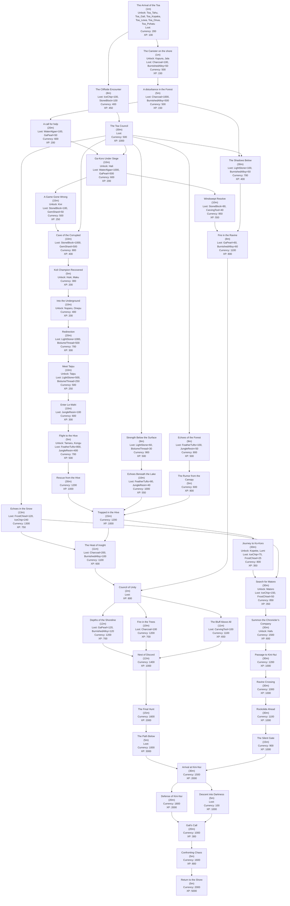

```mermaid
graph TD
  story_toa_arrival["The Arrival of the Toa
(1m)
Unlock: Toa_Tahu, Toa_Gali, Toa_Kopaka, Toa_Lewa, Toa_Onua, Toa_Pohatu
Loot: 
Currency: 200
XP: 100"]
  maskhunt_kopaka_pohatu_icecliff["The Cliffside Encounter
(8m)
Loot: IceChip=100, StoneBlock=100
Currency: 400
XP: 450"]
  story_toa_council["The Toa Council
(30m)
Loot: 
Currency: 500
XP: 1000"]
  maskhunt_tahu_cave_akaku["The Shadows Below
(30m)
Loot: LightStone=100, BurnishedAlloy=50
Currency: 700
XP: 400"]
  maskhunt_lewa_pakari["Strength Below the Surface
(9m)
Loot: LightStone=60, BiolumeThread=30
Currency: 900
XP: 500"]
  maskhunt_kopaka_mahiki_huna["Echoes in the Snow
(13m)
Loot: FrostChisel=120, IceChip=240
Currency: 1300
XP: 750"]
  maskhunt_lewa_kakama_komau["Echoes Beneath the Lake
(10m)
Loot: FeatherTufts=80, JungleResin=40
Currency: 1000
XP: 550"]
  maskhunt_onua_matatu_komau["Echoes of the Forest
(9m)
Loot: FeatherTufts=100, JungleResin=50
Currency: 800
XP: 500"]
  maskhunt_onua_jungle_rumor["The Rumor from the Canopy
(5m)
Currency: 600
XP: 800"]
  maskhunt_gali_miru["Windswept Resolve
(10m)
Loot: StoneBlock=80, CarvingTool=40
Currency: 950
XP: 550"]
  maskhunt_gali_rescue["Fire in the Ravine
(8m)
Loot: GaPearl=60, BurnishedAlloy=60
Currency: 1100
XP: 800"]
  maskhunt_kopaka_pakari["The Heat of Insight
(11m)
Loot: Charcoal=200, BurnishedAlloy=100
Currency: 1100
XP: 600"]
  story_toa_second_council["Council of Unity
(2m)
Loot: 
XP: 800"]
  maskhunt_tahu_miru["Depths of the Shoreline
(12m)
Loot: GaPearl=120, BurnishedAlloy=120
Currency: 1200
XP: 700"]
  maskhunt_pohatu_kaukau_bluff["The Bluff Above All
(11m)
Loot: CarvingTool=100
Currency: 1100
XP: 650"]
  maskhunt_forest_tahu_kakama["Fire in the Trees
(10m)
Loot: Charcoal=100
Currency: 1200
XP: 700"]
  story_nui_jaga_nest["Nest of Discord
(12m)
Currency: 1400
XP: 1000"]
  maskhunt_final_collection["The Final Hunt
(15m)
Currency: 1600
XP: 2000"]
  story_kini_nui_gathering["The Path Below
(5m)
Loot: 
Currency: 1000
XP: 3000"]
  story_kini_nui_descent["Descent into Darkness
(5m)
Loot: 
Currency: 100
XP: 1000"]
  mnog_find_canister_beach["The Canister on the shore
(1m)
Unlock: Kapura, Jala
Loot: Charcoal=100, BurnishedAlloy=50
Currency: 500
XP: 150"]
  mnog_tahu_unlock_01["A disturbance in the Forest
(5m)
Loot: Charcoal=1000, BurnishedAlloy=500
Currency: 500
XP: 150"]
  mnog_ga_koro_sos["A call for help
(20m)
Loot: WaterAlgae=100, GaPearl=50
Currency: 600
XP: 200"]
  mnog_restore_ga_koro["Ga-Koro Under Siege
(10m)
Unlock: Hali
Loot: WaterAlgae=1000, GaPearl=500
Currency: 600
XP: 200"]
  mnog_po_koro_sickness["A Game Gone Wrong
(15m)
Unlock: Kivi
Loot: StoneBlock=100, GemShard=50
Currency: 500
XP: 250"]
  mnog_po_koro_cave_investigation["Cave of the Corrupted
(10m)
Loot: StoneBlock=1000, GemShard=500
Currency: 800
XP: 400"]
  mnog_recruit_hewkii["Koli Champion Recovered
(5m)
Unlock: Huki, Maku
Currency: 300
XP: 200"]
  mnog_arrive_onu_koro["Into the Underground
(10m)
Unlock: Nuparu, Onepu
Currency: 400
XP: 200"]
  mnog_onu_koro_lava_problem["Redirection
(20m)
Loot: LightStone=1000, BiolumeThread=500
Currency: 700
XP: 300"]
  mnog_meet_taipu["Meet Taipu
(10m)
Unlock: Taipu
Loot: LightStone=500, BiolumeThread=250
Currency: 500
XP: 250"]
  mnog_enter_le_wahi["Enter Le-Wahi
(10m)
Loot: JungleResin=100
Currency: 600
XP: 300"]
  mnog_flight_to_hive["Flight to the Hive
(5m)
Unlock: Tamaru, Kongu
Loot: FeatherTufts=800, JungleResin=400
Currency: 700
XP: 500"]
  mnog_rescue_from_hive["Rescue from the Hive
(30m)
Currency: 1200
XP: 1000"]
  mnog_lewa_v_onua["Trapped in the Hive
(15m)
Currency: 1200
XP: 1000"]
  mnog_arrive_ko_koro["Journey to Ko-Koro
(30m)
Unlock: Kopeke, Lumi
Loot: IceChip=75, FrostChisel=25
Currency: 800
XP: 350"]
  mnog_search_for_matoro["Search for Matoro
(30m)
Unlock: Matoro
Loot: IceChip=150, FrostChisel=50
Currency: 850
XP: 350"]
  mnog_summon_chroniclers_company["Summon the Chronicler’s Company
(30m)
Unlock: Hafu
Currency: 1500
XP: 600"]
  mnog_journey_to_kini_nui_1["Passage to Kini-Nui
(30m)
Currency: 1200
XP: 1000"]
  mnog_journey_to_kini_nui_2["Ravine Crossing
(30m)
Currency: 1000
XP: 1000"]
  mnog_journey_to_kini_nui_3["Rockslide Ahead
(30m)
Currency: 1100
XP: 1000"]
  mnog_journey_to_kini_nui_4["The Silent Gate
(15m)
Currency: 900
XP: 1000"]
  mnog_kini_nui_arrival["Arrival at Kini-Nui
(30m)
Currency: 1500
XP: 2000"]
  mnog_kini_nui_defense["Defense of Kini-Nui
(20m)
Currency: 1800
XP: 2000"]
  mnog_gali_call["Gali's Call
(20m)
Currency: 1000
XP: 300"]
  mnog_witness_makuta_battle["Confronting Chaos
(5m)
Currency: 1600
XP: 800"]
  mnog_return_to_shore["Return to the Shore
(5m)
Currency: 2000
XP: 5000"]
  story_toa_arrival --> maskhunt_kopaka_pohatu_icecliff
  maskhunt_kopaka_pohatu_icecliff --> story_toa_council
  mnog_tahu_unlock_01 --> maskhunt_tahu_cave_akaku
  story_toa_council --> maskhunt_tahu_cave_akaku
  story_toa_council --> maskhunt_lewa_pakari
  story_toa_council --> maskhunt_kopaka_mahiki_huna
  maskhunt_lewa_pakari --> maskhunt_lewa_kakama_komau
  story_toa_council --> maskhunt_onua_matatu_komau
  maskhunt_onua_matatu_komau --> maskhunt_onua_jungle_rumor
  mnog_restore_ga_koro --> maskhunt_gali_miru
  maskhunt_gali_miru --> maskhunt_gali_rescue
  maskhunt_tahu_cave_akaku --> maskhunt_gali_rescue
  maskhunt_kopaka_mahiki_huna --> maskhunt_kopaka_pakari
  mnog_lewa_v_onua --> maskhunt_kopaka_pakari
  maskhunt_kopaka_pakari --> story_toa_second_council
  maskhunt_gali_rescue --> story_toa_second_council
  story_toa_second_council --> maskhunt_tahu_miru
  story_toa_second_council --> maskhunt_pohatu_kaukau_bluff
  story_toa_second_council --> maskhunt_forest_tahu_kakama
  maskhunt_tahu_miru --> story_nui_jaga_nest
  maskhunt_forest_tahu_kakama --> story_nui_jaga_nest
  maskhunt_pohatu_kaukau_bluff --> story_nui_jaga_nest
  story_nui_jaga_nest --> maskhunt_final_collection
  maskhunt_final_collection --> story_kini_nui_gathering
  mnog_kini_nui_arrival --> story_kini_nui_descent
  story_toa_arrival --> mnog_find_canister_beach
  mnog_find_canister_beach --> mnog_tahu_unlock_01
  mnog_tahu_unlock_01 --> mnog_ga_koro_sos
  mnog_ga_koro_sos --> mnog_restore_ga_koro
  story_toa_council --> mnog_restore_ga_koro
  mnog_restore_ga_koro --> mnog_po_koro_sickness
  mnog_po_koro_sickness --> mnog_po_koro_cave_investigation
  story_toa_council --> mnog_po_koro_cave_investigation
  mnog_po_koro_cave_investigation --> mnog_recruit_hewkii
  mnog_recruit_hewkii --> mnog_arrive_onu_koro
  mnog_arrive_onu_koro --> mnog_onu_koro_lava_problem
  mnog_onu_koro_lava_problem --> mnog_meet_taipu
  mnog_meet_taipu --> mnog_enter_le_wahi
  mnog_enter_le_wahi --> mnog_flight_to_hive
  mnog_flight_to_hive --> mnog_rescue_from_hive
  mnog_rescue_from_hive --> mnog_lewa_v_onua
  maskhunt_lewa_kakama_komau --> mnog_lewa_v_onua
  maskhunt_onua_jungle_rumor --> mnog_lewa_v_onua
  mnog_lewa_v_onua --> mnog_arrive_ko_koro
  mnog_arrive_ko_koro --> mnog_search_for_matoro
  maskhunt_kopaka_mahiki_huna --> mnog_search_for_matoro
  mnog_search_for_matoro --> mnog_summon_chroniclers_company
  mnog_summon_chroniclers_company --> mnog_journey_to_kini_nui_1
  mnog_journey_to_kini_nui_1 --> mnog_journey_to_kini_nui_2
  mnog_journey_to_kini_nui_2 --> mnog_journey_to_kini_nui_3
  mnog_journey_to_kini_nui_3 --> mnog_journey_to_kini_nui_4
  story_kini_nui_gathering --> mnog_kini_nui_arrival
  mnog_journey_to_kini_nui_4 --> mnog_kini_nui_arrival
  mnog_kini_nui_arrival --> mnog_kini_nui_defense
  mnog_kini_nui_defense --> mnog_gali_call
  story_kini_nui_descent --> mnog_gali_call
  mnog_gali_call --> mnog_witness_makuta_battle
  mnog_witness_makuta_battle --> mnog_return_to_shore
```