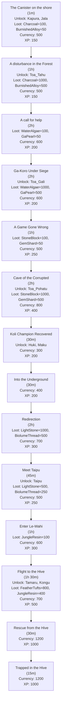

```mermaid
graph TD
  story_find_canister_beach["The Canister on the shore
(1m)
Unlock: Kapura, Jala
Loot: Charcoal=100, BurnishedAlloy=50
Currency: 500
XP: 150"]
  story_tahu_unlock_01["A disturbance in the Forest
(1h)
Unlock: Toa_Tahu
Loot: Charcoal=1000, BurnishedAlloy=500
Currency: 500
XP: 150"]
  story_ga_koro_sos["A call for help
(2h)
Loot: WaterAlgae=100, GaPearl=50
Currency: 600
XP: 200"]
  story_restore_ga_koro["Ga-Koro Under Siege
(2h)
Unlock: Toa_Gali
Loot: WaterAlgae=1000, GaPearl=500
Currency: 600
XP: 200"]
  story_po_koro_sickness["A Game Gone Wrong
(1h)
Loot: StoneBlock=100, GemShard=50
Currency: 500
XP: 250"]
  story_po_koro_cave_investigation["Cave of the Corrupted
(2h)
Unlock: Toa_Pohatu
Loot: StoneBlock=1000, GemShard=500
Currency: 800
XP: 400"]
  story_recruit_hewkii["Koli Champion Recovered
(30m)
Unlock: Huki, Maku
Currency: 300
XP: 200"]
  story_arrive_onu_koro["Into the Underground
(30m)
Currency: 400
XP: 200"]
  story_onu_koro_lava_problem["Redirection
(2h)
Loot: LightStone=1000, BiolumeThread=500
Currency: 700
XP: 300"]
  story_meet_taipu["Meet Taipu
(45m)
Unlock: Taipu
Loot: LightStone=500, BiolumeThread=250
Currency: 500
XP: 250"]
  story_enter_le_wahi["Enter Le-Wahi
(1h)
Loot: JungleResin=100
Currency: 600
XP: 300"]
  story_flight_to_hive["Flight to the Hive
(1h 30m)
Unlock: Tamaru, Kongu
Loot: FeatherTufts=800, JungleResin=400
Currency: 700
XP: 500"]
  story_rescue_from_hive["Rescue from the Hive
(30m)
Currency: 1200
XP: 1000"]
  story_lewa_v_onua["Trapped in the Hive
(15m)
Currency: 1200
XP: 1000"]
  story_find_canister_beach --> story_tahu_unlock_01
  story_tahu_unlock_01 --> story_ga_koro_sos
  story_ga_koro_sos --> story_restore_ga_koro
  story_restore_ga_koro --> story_po_koro_sickness
  story_po_koro_sickness --> story_po_koro_cave_investigation
  story_po_koro_cave_investigation --> story_recruit_hewkii
  story_recruit_hewkii --> story_arrive_onu_koro
  story_arrive_onu_koro --> story_onu_koro_lava_problem
  story_onu_koro_lava_problem --> story_meet_taipu
  story_meet_taipu --> story_enter_le_wahi
  story_enter_le_wahi --> story_flight_to_hive
  story_flight_to_hive --> story_rescue_from_hive
  story_rescue_from_hive --> story_lewa_v_onua
```
